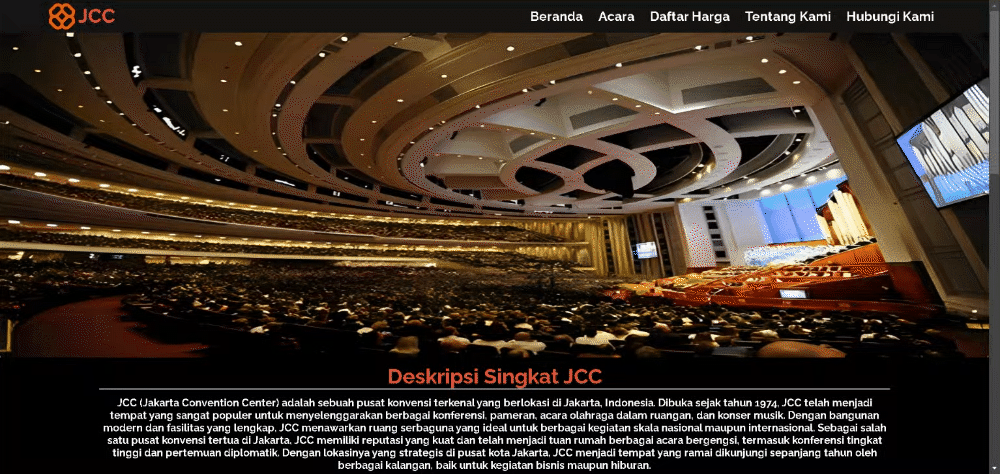

# JCC

This is my first website project, showcasing the Jakarta Convention Center (JCC). The website focuses on front-end functionality, providing an intuitive user interface to highlight JCC's key features and services.

---

## Table of Contents

- [Features](#features)
- [Technologies](#Technologies)
- [Website](#Website)

---

## Features:
- **Core Components**: Designed and developed using HTML, CSS, and JavaScript.
- **Fully Functional**: Implemented dynamic elements to enhance user experience.
- **Image Gallery or Slideshow**: Showcase JCC events or facilities with an image carousel or gallery.

---

## Technologies
- **HTML**: Structured the layout and content of the site.
- **CSS**: Styled the website with an emphasis on visual design and responsiveness.
- **JavaScript**: Added interactivity and dynamic features.

---

## Website
[Website](https://kevinsutrisna.github.io/JCC/)
